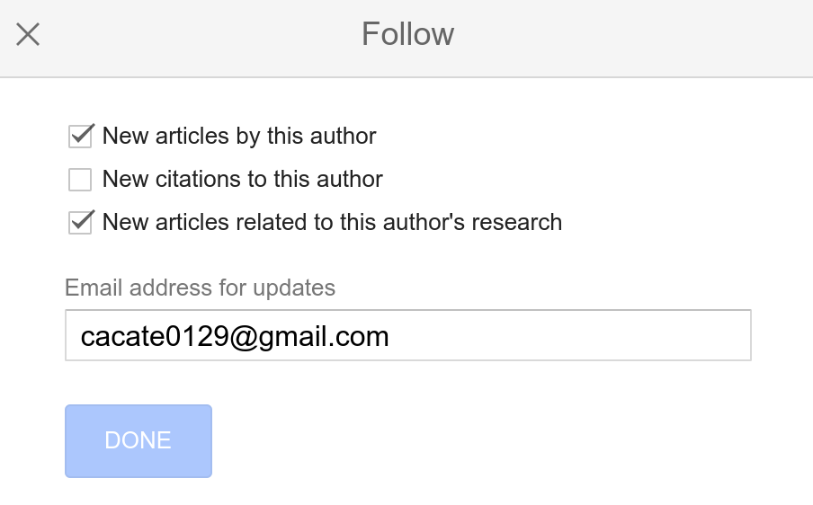

# How to get updated with the latest research

This guide is entry level guide for beginners to conduct a survey and get updated with the latest research.

## Use Google Scholar to conduct a survey
[Google Scholar](https://scholar.google.com/) is a freely accessible web search engine that indexes the full text or metadata of scholarly literature across an array of publishing formats and disciplines.

You may have a keyword or an article in mind, and you want to know more about it. Here is how you can use Google Scholar to conduct a survey.
1. Go to [Google Scholar](https://scholar.google.com/).
2. Type the keyword or the article title in the search bar and click the search button.
3. You will see a list of articles related to the keyword or the article title. The more citations an article has, the more influential it is.
4. If you want to have a deeper understanding of the article, please
  1. check the articles that cite the article, and check how these articles comment on the article,
  2. check the references of the article.
5. If you want to keep a copy of the article, [Zotero](https://www.zotero.org/) is a good tool to help you manage your references. Combined with the [Zotero Connector](https://www.zotero.org/download/connectors), you can save the article with one click 🥳.

## Get updated with the latest research
1. Setup a Google Scholar account.
2. Search for the researchers you are interested in.
    
3. Follow the researchers you are interested in by clicking the "Follow" button on their profile.
   
   1. New articles from the researchers: updated less frequently
   2. New articles related to this author's research: updated more frequently