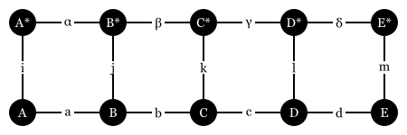
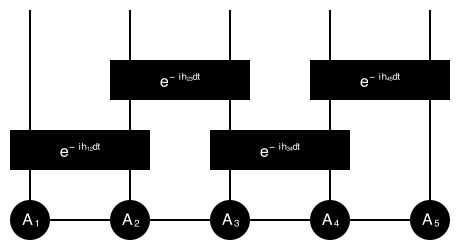

# Tensor networks

## Model: Heisenberg model
The Hamiltonian of the $n$-site Heisenberg chain model is
```math
H = \sum_{i=1}^{n-1} \vec S_i \cdot \vec S_{i+1}
```
where $\vec S_i$ is the spin operator at site $i$.

Properties:
1. Translation invariance (periodic boundary condition or infinite chain)
2. Symmetry: $SU(2)$ symmetry
3. Ground state energy per site: -1.7726

## Mathematic foundation

### Diagrammatic representation
#### Example 1: Trace Permutation
Diagram:


Math:
```math
{\rm con}(\{i, j, k\}, \{A_{ij}, B_{jk}, C_{ik}\}, \{\})
```
Julia:
```julia
ein"ij,jk,ik->"(A, B, C)
```
#### Example 2: SVD decomposition
Diagram:


Math:
```math
{\rm con}(\{i, j, k\}, \{U_{ij}, S_{j}, V_{jk}\}, \{i, k\})
```

Julia:
```julia
ein"ij,j,k->ik"(U, S, V)
```

#### Example 3: Fast Fourier Transform (FFT)
   https://book.jinguo-group.science/stable/chap3/fft/

### Contraction order
https://github.com/TensorBFS/OMEinsumContractionOrders.jl

1. What is a good contraction order?
2. Space complexity and tree width
3. Algorithms to find the optimal contraction order

### Automatic differentiation
Adjoint:
```math
\overline{x} = \frac{\partial \mathcal{L}}{\partial x}
```
where $\mathcal{L}$ is the loss function and $x$ is a vector.

Differential form:
```math
\delta \mathcal{L} = \overline{x}^T \delta x
```

Backward rule of einsum:
Consider
```math
T^{(0)} = {\rm con}(\Lambda, \{T^{(i)}_{\sigma_i} \mid i=1,\ldots,m\}, \sigma_0)
```
where $\Lambda = \cup_{i=0}^m \sigma_i$ is a set of indices, $T^{(i)}$ are tensors, and $\sigma_0$ is the output index.
```math
\delta T^{(0)} = \sum_k{\rm con}(\Lambda, \{T^{(i)}_{\sigma_i} \mid i=1,\ldots,m, i\neq k\} \cup \{\delta T^{(k)}_{\sigma_k}\}, \sigma_0)
```
The differential form is:
```math
\delta \mathcal{L} = \sum_{k=1}^m{\rm con}(\sigma_k, \{\delta T^{(k)}_{\sigma_k}, \overline T_{\sigma_k}\}, \emptyset) = {\rm con}(\sigma_0, \{\delta T^{(0)}_{\sigma_0}, \overline T_{\sigma_0}\}, \emptyset)
```
We have
```math
\overline T^{(k)}_{\sigma_k} = {\rm con}(\Lambda, \{T^{(i)}_{\sigma_i} \mid i=1,\ldots,m, i\neq k\} \cup \{\overline T^{(0)}_{\sigma_0}\}, \sigma_k)
```

Q: How about complex numbers?
- Rule based AD: derive the rules using the Wirtinger calculus
- Source-to-source AD: same as real numbers

## Entanglement
1. Every multipartite quantum state has a Schmidt decomposition
```math
\ket{\psi} = \sum_{i} \lambda_i \ket{i}_A \ket{i}_B,\\
\sum_{i} \lambda_i^2 = 1, \lambda_i \geq 0.
```
2. Schmidt decomposition can be related to singular value decomposition (SVD)
3. The entanglement entropy is defined as
```math
S = -\sum_i \lambda_i^2 \log_2 \lambda_i^2.
```
4. Reduced density matrix - the tensor network representation
```math
\rho_A = \text{Tr}_B \ket{\psi}\bra{\psi}.
```
5. The eigenvalues of the reduced density matrix are the squares of the Schmidt coefficients.

## Matrix Product States (MPS)

### A matrix product state is a tensor network representation of a quantum state.
1. Example: product state
2. Example: GHZ state
3. Example: AKLT state (Ref. [^Schollwock2010] P31)
### Entanglement entropy and the area law
1.  Schmidt decomposition
2. Systems with area law, exponentially decaying entanglement entropy
3. Compression: How does truncation error relate to the expectation value?
### Fidelity & expectation value
1. Norm of the state

2. Reduced density matrix
### Canonical form and Vidal form
### Time evolution
1. Baker–Campbell–Hausdorff (BCH) formula and Trotter decomposition
   The dual of the BCH formula is the Zassenhaus formula
    ```math
    e^{t(X+Y)}=e^{tX}~e^{tY}~e^{-{\frac {t^{2}}{2}}[X,Y]}~e^{{\frac {t^{3}}{6}}(2[Y,[X,Y]]+[X,[X,Y]])}~e^{{\frac {-t^{4}}{24}}([[[X,Y],X],X]+3[[[X,Y],X],Y]+3[[[X,Y],Y],Y])}\cdots
    ```
    When $dt$ is small, the first order Trotter decomposition is accurate
    ```math
    e^{dt(X+Y)} \approx e^{dtX} e^{dtY}
    ```
2. Time-evolving block decimation (TEBD)
Consider the time evolution of a local Hamiltonian
```math
H = \sum_i h_{i,i+1}
```
where $h_{i, i+1}$ is a local Hamiltonian. The time evolution operator is
```math
U(dt) = e^{-iHdt} \approx \prod_i e^{-ih_{i,i+1} dt}
```



### Ground state finding
1.  Variational optimization
2.  DMRG algorithm
### Infinite translation invariant system[^Vanderstraeten2018]
1. Transfer matrix
2. Infinite MPS
3.  VUMPS
4.  TDVP
### Open quantum systems

## Two-dimensional Tensor Networks
1. Projected entangled pair states (PEPS)
   1. The problem of contraction complexity
   2. MPS^2 and Mose move
2. Corner transfer matrix renormalization group (CTMRG)
3. Fermionic system
4. PEPS + VMC

## From Quantum Circuit to Tensor Networks
1. Tensor network based simulation
2. Special gates
3. Expectation value
4. ZX-calculus
5. Optimal contraction order and treewidth
6. Entanglement propagation
   1. Lieb Robinson bound, check entanglement entropy

## Classical Tensor Networks
1. Tensor renormalization group (TRG)
2. Probabilistic graphical models
3. Combinatorial optimization
   1. Example: Spin-glass
   2. Example: Maximum independent set
   3. Example: Circuit SAT
      1. Is it possible to reduce spin-glass to circuit SAT?
4. Generic tensor networks
5. Overlap gap property
   1. Discuss hardest instance complexity and average complexity
6. From factoring to independent set problem

## References
[^Schollwock2010]: Schollwöck, U., 2011. Schollwöck, U. (2011). The density-matrix renormalization group in the age of matrix product states. Annals of Physics 326, 96–192. https://doi.org/10.1016/j.aop.2010.09.012
[^Vanderstraeten2018]: Vanderstraeten, L., Haegeman, J., Verstraete, F., 2018. Tangent-space methods for uniform matrix product states.
[^TensorsNet]: https://www.tensors.net/