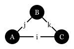
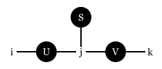
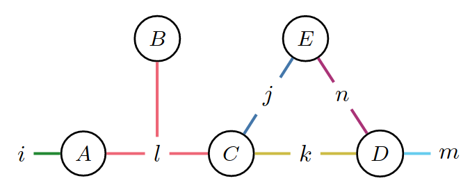
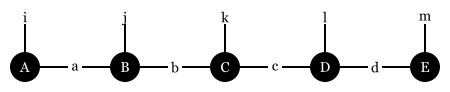

# Tensor networks

## 1. Mathematic foundation

### Definition
A tensor network is a triple $\{\Lambda, \{T^{(i)}_{\sigma_i}\}, \sigma_0\}$[^Roa2024], where
- $\Lambda$ is a set of indices,
- $\{T^{(i)}_{\sigma_i}\}$ is a set of tensors and the associated indices, and
- $\sigma_0$ is the output indices.

The contraction of a tensor network is defined as
```math
{\rm con}(\Lambda, \{T^{(i)}_{\sigma_i}\}, \sigma_0) = \sum_{\Lambda\setminus\sigma_0} \prod_{i=1}^m T^{(i)}_{\sigma_i}
```

### Diagrammatic representation
We use a node to denote a tensor and a line to denote an index.
#### Example 1.1: Trace Permutation
Diagram:


Math:
```math
{\rm con}(\{i, j, k\}, \{A_{ij}, B_{jk}, C_{ki}\}, \{\})
```
Julia:
```julia
ein"ij,jk,ki->"(A, B, C)
```
#### Example 1.2: SVD decomposition
Diagram:


Math:
```math
{\rm con}(\{i, j, k\}, \{U_{ij}, S_{j}, V_{jk}\}, \{i, k\})
```

Julia:
```julia
ein"ij,j,jk->ik"(U, S, V)
```

### Contraction order
1. A good contraction order reduces: space complexity, time complexity and read-write complexity
2. The space complexity of a contraction order is related to tree width in graph theory
3. Algorithms to find the optimal contraction order, Please check: https://github.com/TensorBFS/OMEinsumContractionOrders.jl

#### Example 1.3: Contraction order


Q1: What is the Julia code for the above diagram?
$$
\begin{align}
  \begin{split}
    &{\rm con}(\{i,j,k,l,m,n\}, \\
    & \quad\quad\{A_{\{i, l\}}, B_{\{l\}}, C_{\{k, j, l\}}, D_{\{k, m, n\}}, E_{\{j, n\}}\},\\
    & \quad\quad\{i,m\}) \\
    & =\sum_{j,k,l,n}A_{\{i,l\}} B_{\{l\}} C_{\{k,l\}} D_{\{k, m\}} E_{\{j, n\}}.
  \end{split}
\end{align}
$$

Q2: Given the contraction tree below, what is the corresponding time complexity, space complexity and read-write complexity?


*Slicing technique* can be used to reduce the space complexity of the contraction order.

#### Example 3: Fast Fourier Transform (FFT)
- https://book.jinguo-group.science/stable/chap3/fft/
- https://zhuanlan.zhihu.com/p/696638919


## 2. Matrix Product States (MPS)

A matrix product state is a tensor network representation of a quantum state.



Q: What is the rank of the above MPS?
Q: Let the virtual bond dimension be $D$, what is the space complexity of the MPS?

1. Example: product state
2. Example: GHZ state
3. Example: AKLT state (Ref. [^Schollwock2010] P31)

### Entanglement entropy and the area law
1. Every multipartite quantum state has a Schmidt decomposition
```math
\ket{\psi} = \sum_{i} \lambda_i \ket{i}_A \ket{i}_B,\\
\sum_{i} \lambda_i^2 = 1, \lambda_i \geq 0.
```
2. Schmidt decomposition can be related to singular value decomposition (SVD).
3. The entanglement entropy is defined as
```math
S = -\sum_i \lambda_i^2 \log_2 \lambda_i^2.
```
4. Reduced density matrix - the tensor network representation
```math
\rho_A = \text{Tr}_B \ket{\psi}\bra{\psi}.
```
5. The eigenvalues of the reduced density matrix are the squares of the Schmidt coefficients.


1.  Schmidt decomposition
2. Systems with area law
3. Compression: How does truncation error relate to the expectation value?
### Fidelity & expectation value
1. Norm of the state

2. Reduced density matrix
### Canonical form and Vidal form
### Time evolution
1. Baker–Campbell–Hausdorff (BCH) formula and Trotter decomposition
   The dual of the BCH formula is the Zassenhaus formula
    ```math
    e^{t(X+Y)}=e^{tX}~e^{tY}~e^{-{\frac {t^{2}}{2}}[X,Y]}~e^{{\frac {t^{3}}{6}}(2[Y,[X,Y]]+[X,[X,Y]])}~e^{{\frac {-t^{4}}{24}}([[[X,Y],X],X]+3[[[X,Y],X],Y]+3[[[X,Y],Y],Y])}\cdots
    ```
    When $dt$ is small, the first order Trotter decomposition is accurate
    ```math
    e^{dt(X+Y)} \approx e^{dtX} e^{dtY}
    ```
2. Time-evolving block decimation (TEBD)
Consider the time evolution of a local Hamiltonian
```math
H = \sum_i h_{i,i+1}
```
where $h_{i, i+1}$ is a local Hamiltonian. The time evolution operator is
```math
U(dt) = e^{-iHdt} \approx \prod_i e^{-ih_{i,i+1} dt}
```


### Ground state finding
1.  Variational optimization
2.  DMRG algorithm
### Infinite translation invariant system[^Vanderstraeten2018]
1. Transfer matrix
2. Infinite MPS
3.  VUMPS
4.  TDVP


### Video

- [Norbert Schuch: Matrix product states and tensor networks (I)](https://youtu.be/W_IBEAzqm4U?si=MWV_qVt_JmA6HsNl)
- [Norbert Schuch: Matrix product states and tensor networks (II)](https://youtu.be/yLpWKvk2fzY?si=J0QzYIZggQFRQ-nL)
- [Norbert Schuch - Lower bounding ground state energies through renormalization and tensor networks](https://youtu.be/eGpDw8tVG3c?si=GVuypEvLRL2wCChD)
- [Tutorial on Tensor Networks and Quantum Computing with Miles Stoudenmire](https://www.youtube.com/watch?v=fq3_7vBcj3g&t=538s)

### Automatic differentiation

*Differentiating a tensor in a tensor network contraction is equivalent to removing the tensor.*

Adjoint:
```math
\overline{x} = \frac{\partial \mathcal{L}}{\partial x}
```
where $\mathcal{L}$ is the loss function and $x$ is a vector.

Differential form:
```math
\delta \mathcal{L} = \overline{x}^T \delta x
```

Backward rule of einsum:
Consider
```math
T^{(0)} = {\rm con}(\Lambda, \{T^{(i)}_{\sigma_i} \mid i=1,\ldots,m\}, \sigma_0)
```
where $\Lambda = \cup_{i=0}^m \sigma_i$ is a set of indices, $T^{(i)}$ are tensors, and $\sigma_0$ is the output index.
```math
\delta T^{(0)} = \sum_k{\rm con}(\Lambda, \{T^{(i)}_{\sigma_i} \mid i=1,\ldots,m, i\neq k\} \cup \{\delta T^{(k)}_{\sigma_k}\}, \sigma_0)
```
The differential form is:
```math
\delta \mathcal{L} = \sum_{k=1}^m{\rm con}(\sigma_k, \{\delta T^{(k)}_{\sigma_k}, \overline T_{\sigma_k}\}, \emptyset) = {\rm con}(\sigma_0, \{\delta T^{(0)}_{\sigma_0}, \overline T_{\sigma_0}\}, \emptyset)
```
We have
```math
\overline T^{(k)}_{\sigma_k} = {\rm con}(\Lambda, \{T^{(i)}_{\sigma_i} \mid i=1,\ldots,m, i\neq k\} \cup \{\overline T^{(0)}_{\sigma_0}\}, \sigma_k)
```

Q: How about complex numbers?
- Rule based AD: derive the rules using the Wirtinger calculus
- Source-to-source AD: same as real numbers

#### Example: 


### Open quantum systems

## Two-dimensional Tensor Networks
1. Projected entangled pair states (PEPS)
   1. The problem of contraction complexity
   2. MPS^2 and Mose move
2. Corner transfer matrix renormalization group (CTMRG)
3. Fermionic system
4. PEPS + VMC

## From Quantum Circuit to Tensor Networks
1. Tensor network based simulation
2. Special gates
3. Expectation value
4. ZX-calculus
5. Optimal contraction order and treewidth
6. Entanglement propagation
   1. Lieb Robinson bound, check entanglement entropy

## Classical Tensor Networks
1. Tensor renormalization group (TRG)
2. Probabilistic graphical models
3. Combinatorial optimization
   1. Example: Spin-glass
   2. Example: Maximum independent set
   3. Example: Circuit SAT
      1. Is it possible to reduce spin-glass to circuit SAT?
4. Generic tensor networks
5. Overlap gap property
   1. Discuss hardest instance complexity and average complexity
6. From factoring to independent set problem

## References
[^Schollwock2010]: Schollwöck, U., 2011. Schollwöck, U. (2011). The density-matrix renormalization group in the age of matrix product states. Annals of Physics 326, 96–192. https://doi.org/10.1016/j.aop.2010.09.012
[^Vanderstraeten2018]: Vanderstraeten, L., Haegeman, J., Verstraete, F., 2018. Tangent-space methods for uniform matrix product states.
[^TensorsNet]: https://www.tensors.net/
[^Liu2023]: Computing Solution Space Properties of Combinatorial Optimization Problems Via Generic Tensor Networks. SIAM J. Sci. Comput. 45, A1239–A1270. https://doi.org/10.1137/22M1501787
[^Roa2024]: Roa-Villescas, M., Gao, X., Stuijk, S., Corporaal, H., Liu, J.-G., 2024. Probabilistic Inference in the Era of Tensor Networks and Differential Programming. https://doi.org/10.48550/arXiv.2405.14060
