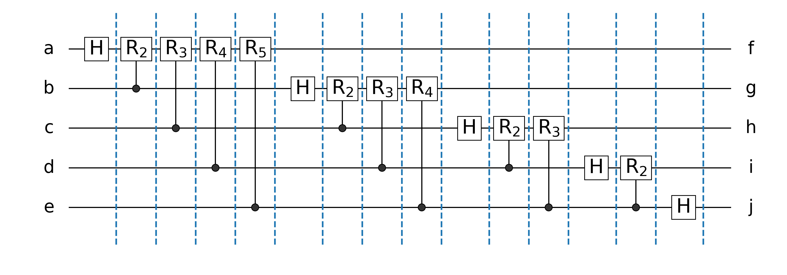
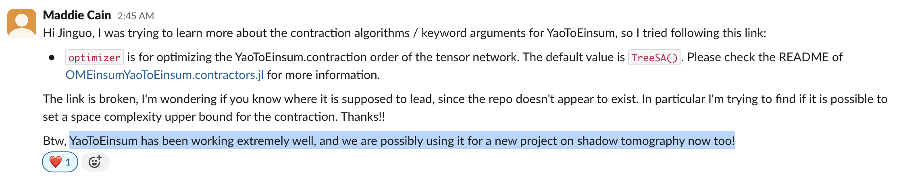

# How to compute quantum circuit by tensor network contraction

## Example: QFT circuit

1. the Hadamard gate $\text{H}$ is a rank-2 tensor
2. the CPHASE gate $\text{CPHASE}$ is a rank-4 tensor

Q: How to represent $\text{CNOT}$ and $\text{CZ}$ gates?

## Tensor network based simulation of quantum circuits

